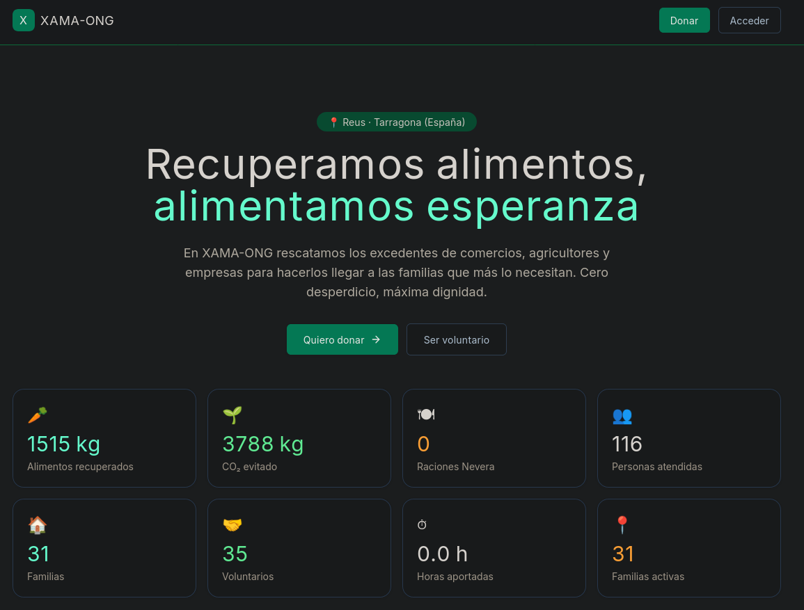

# 🌱 XAMA-ONG Platform

> Plataforma Integral de gestión logística para ONG dedicadas a la
> recuperación de alimentos y su distribución a familias en situación
> de vulnerabilidad.

---

## 📖 Tabla de contenidos

- [¿Qué es?](#-qué-es)
- [Características](#-características)
- [Stack tecnológico](#-stack-tecnológico)
- [Inicio rápido](#-inicio-rápido)
- [Estructura](#-estructura-del-proyecto)
- [Módulos](#-módulos)
- [Roles y permisos](#-roles-y-permisos)
- [API REST](#-api-rest)
- [Datos de prueba](#-datos-de-prueba)
- [Tests](#-tests)
- [Despliegue](#-despliegue)
- [Código abierto](#-código-abierto)
- [Desarrollador](#-desarrollador)
- [Licencia](#-licencia)

---

## 🌱 ¿Qué es?

**XAMA-ONG Platform** es una plataforma web de código abierto pensada para
centralizar toda la operativa diaria de una ONG dedicada a la recuperación
de alimentos:

- **Recogida de excedentes** de comercios, agricultores y empresas.
- **Control de caducidades** con sistema FeFo (First Expire First Out).
- **Repartos semanales** a familias en situación de vulnerabilidad.
- **Gestión de voluntariado** con turnos, roles y horas acreditadas.
- **Nevera Solidària** con raciones diarias y derivaciones puntuales.
- **Métricas de impacto** para Asamblea, subvenciones y empresas donantes.

Además, incluye una **portada pública** desde la que cualquier persona o
empresa puede:

- Conocer el impacto real (contadores animados en tiempo real).
- Donar por Bizum o transferencia bancaria.
- Descargar el certificado fiscal de donación (Ley 49/2002).
- Solicitar ser voluntario.

### 🎯 ¿Para quién es?

- **Bancos de alimentos** y entidades de reparto.
- **Comedores sociales** con excedentes recuperados.
- **Asociaciones vecinales** con proyectos de recuperación alimentaria.
- **Cualquier ONG** que gestione inventario, voluntariado y beneficiarios.

**Es código abierto.** Si eres otra ONG y te sirve, puedes clonarlo,
adaptarlo y ponerlo en marcha sin coste de licencia.

---

## ✨ Características

### Backend
- 🔐 **Autenticación JWT** con 5 roles diferenciados.
- 📦 **Inventario** con trazabilidad de lotes y control FeFo.
- 👨‍👩‍👧 **Familias beneficiarias** con fichas y restricciones dietéticas.
- 🚚 **Repartos** con check-in en puerta desde móvil/tablet.
- 🤝 **Voluntariado** con turnos Reus / Tarragona y ranking de horas.
- 🍽 **Nevera Solidària** con raciones diarias y derivaciones.
- 📊 **Métricas de impacto** con exportación CSV, Excel y PDF.
- 📄 **Certificados PDF** de voluntariado y de donación fiscal.
- 🔍 **Auditoría** con registro de quién hizo qué y cuándo.
- 🗑 **Papelera** con restauración y borrado masivo.
- 📥 **Importación CSV** de familias.
- 📧 **Notificaciones** automáticas de caducidades por email.

### Frontend
- 🎨 **Diseño consistente** con design tokens centralizados.
- 🌙 **Modo oscuro** en toda la aplicación interna.
- ⚡ **SSG/ISR** en la portada pública (carga ~50ms).
- 📊 **Panel de analítica** con gráficos interactivos (Recharts).
- 🔔 **Toasts** para feedback visual de acciones.
- 📱 **Responsive** (móvil, tablet, escritorio).
- ♿ **Accesibilidad** con focus visible y navegación por teclado.

---

## 🛠 Stack tecnológico

| Capa | Tecnología |
|------|------------|
| **Frontend** | Next.js 14 · React 18 · TypeScript · Tailwind CSS |
| **UI** | Lucide Icons · Recharts · Sonner (toasts) |
| **Backend** | FastAPI · Python 3.12 · SQLAlchemy 2.0 (async) |
| **Base de datos** | PostgreSQL 16 |
| **Cache** | Redis 7 |
| **Migraciones** | Alembic |
| **Contenedores** | Docker · Docker Compose |
| **CI/CD** | GitHub Actions (ruff + pytest + next build) |
| **Tests** | pytest · 32 tests |
| **Lint** | ruff |
| **Deploy** | Cloudflare Tunnel (opcional) |

---

## 🚀 Inicio rápido

### Requisitos

- Docker y Docker Compose instalados
- Puertos libres: 3100 (web), 8100 (api), 8080 (adminer opcional)

### Instalación

1. Clonar el repositorio:

   git clone https://github.com/urukaisk-maker/xama-ong-platform.git
   cd xama-ong-platform

2. Configurar entorno:

   cp .env.example .env

3. Generar SECRET_KEY:

   openssl rand -hex 32

4. Editar el archivo .env y ajustar POSTGRES_PASSWORD y SECRET_KEY.

5. Levantar todo:

   docker compose up -d

6. Esperar ~15s a que arranque y verificar:

   docker compose ps

### Accesos

| Servicio | URL |
|----------|-----|
| **Portada pública** | http://localhost:3100/public |
| **Frontend app** | http://localhost:3100 |
| **API docs (Swagger)** | http://localhost:8100/docs |
| **Adminer (DB UI)** | http://localhost:8080 |

### Credenciales por defecto

| Rol | Email | Password |
|-----|-------|----------|
| Junta | admin@xama.local | admin1234 |
| Coordinador Reus | coord.reus@xama.local | coord1234 |
| Coordinador Tarragona | coord.tarragona@xama.local | coord1234 |
| Servicios Sociales | ss@xama.local | ss1234 |
| Voluntario Reus | vol.reus1@xama.local | vol1234 |
| Voluntario Tarragona | vol.tgn1@xama.local | vol1234 |

---

## 📁 Estructura del proyecto

    xama-ong-platform/
    ├── .github/workflows/        # CI (ruff + pytest + next build)
    ├── backend/                  # FastAPI + SQLAlchemy async
    │   ├── app/
    │   │   ├── core/             # config, seguridad JWT
    │   │   ├── db/               # engine async, base declarativa
    │   │   └── modules/
    │   │       ├── auth/         # login, roles, usuarios
    │   │       ├── inventory/    # productos, lotes, FeFo
    │   │       ├── families/     # familias, entregas, check-in
    │   │       ├── volunteers/   # turnos, asignaciones, horas
    │   │       ├── nevera/       # raciones, derivaciones
    │   │       ├── metrics/      # KPIs, informes PDF/CSV/Excel
    │   │       ├── donations/    # certificados de donación
    │   │       ├── notifications/# emails de caducidades
    │   │       ├── audit/        # log de acciones
    │   │       ├── admin/        # papelera, mantenimiento
    │   │       └── public/       # estadísticas públicas
    │   ├── alembic/              # migraciones
    │   ├── scripts/              # seed, check_expiring
    │   └── tests/                # 32 tests con pytest
    ├── frontend/                 # Next.js 14 App Router
    │   ├── src/
    │   │   ├── app/              # páginas
    │   │   ├── components/       # componentes reutilizables
    │   │   └── lib/              # api client, tipos, config
    │   └── public/               # assets estáticos
    ├── database/                 # init.sql (esquema inicial)
    ├── docs/                     # documentación
    └── docker-compose.yml

---

## 📦 Módulos

### 1. Autenticación y usuarios
Login JWT, 5 roles, gestión de usuarios desde el panel de administración.

### 2. Inventario y trazabilidad
Registro de productos y lotes con control FeFo. Alertas de caducidades.

### 3. Familias y repartos
Fichas familiares con adultos, menores y restricciones alimentarias.

### 4. Voluntariado y cuadrantes
Turnos por sede (Reus / Tarragona), roles por jornada, ranking de horas.

### 5. Nevera Solidària
Control de raciones diarias (~20 objetivo) y derivaciones puntuales.

### 6. Métricas e informes
KPIs en tiempo real: kg recuperados, CO₂ evitado, familias atendidas.

### 7. Certificados de donación
Generación de certificados fiscales (Ley 49/2002) para donantes.

### 8. Administración
Auditoría, papelera, mantenimiento masivo.

---

## 🔒 Roles y permisos

| Rol | Acceso |
|-----|--------|
| **junta** | Todo el sistema + gestión de usuarios + auditoría + mantenimiento |
| **coordinador_reus** | Su sede: inventario, familias, entregas, turnos, métricas |
| **coordinador_tarragona** | Ídem para Tarragona |
| **voluntario** | Entregas (check-in), Cuadrantes (apuntarse), Nevera |
| **servicios_sociales** | Solo Nevera (crear derivaciones) |

---

## 🌐 API REST

Todos los endpoints están documentados en Swagger:

**http://localhost:8100/docs**

### Ejemplos de uso

Login:

    curl -X POST http://localhost:8100/api/auth/login \
      -H "Content-Type: application/json" \
      -d '{"email":"admin@xama.local","password":"admin1234"}'

Inventario (con token):

    curl http://localhost:8100/api/inventory/summary \
      -H "Authorization: Bearer $TOKEN"

Lotes que caducan pronto:

    curl "http://localhost:8100/api/inventory/batches/expiring-soon?days=7" \
      -H "Authorization: Bearer $TOKEN"

Estadísticas públicas (sin auth):

    curl http://localhost:8100/api/public/stats

---

## 🌱 Datos de prueba

Para poblar la base de datos con contenido realista:

    docker compose exec xama-api python -m scripts.seed

Esto crea:

- **35 usuarios** (admin, 2 coordinadores, 1 servicios sociales, 31 voluntarios)
- **30 familias** (15 Reus + 15 Tarragona)
- **20 productos** típicos
- **80 lotes** con fechas de caducidad variadas
- **~45 entregas** de los últimos 7 días
- **14 días de raciones Nevera**
- **10 derivaciones** de Servicios Sociales
- **56 turnos** (7 días × 2 sedes × 4 roles)
- **~80 asignaciones** de voluntarios

---

## ✅ Tests

    # Todos los tests
    docker compose exec xama-api pytest

    # Con cobertura
    docker compose exec xama-api pytest --cov=app --cov-report=term-missing

    # Lint
    docker compose exec xama-api ruff check .

**32 tests** cubriendo:

- Autenticación (8)
- Familias (5)
- Inventario (6)
- Métricas (4)
- Nevera (4)
- Voluntariado (5)

---

## 🚢 Despliegue

Ver [docs/DEPLOYMENT.md](docs/DEPLOYMENT.md) para la guía completa.

**Resumen:**

1. **VPS** (Hetzner, DigitalOcean) + **Cloudflare Tunnel** = ~5€/mes
2. **Dominio propio** (~10€/año) con HTTPS automático
3. **Backups automáticos** diarios a las 3:00 AM
4. **Monitorización** con Uptime Kuma + Healthchecks

---

## 🤝 Código abierto

Este proyecto es **código abierto bajo licencia MIT**. Fue creado por
un desarrollador freelance para digitalizar la operativa de una ONG
real en Reus (Tarragona).

**Si eres otra ONG y quieres usarlo:**

1. Clona el repositorio
2. Adapta los textos y datos en `frontend/src/lib/site-config.ts`
3. Cambia los colores si quieres (todo está centralizado)
4. Despliega donde quieras (VPS, Vercel, Railway)
5. Disfruta. Y si mejoras algo, compártelo.

**¿Quieres contribuir?** Mira [CONTRIBUTING.md](CONTRIBUTING.md).

---

## 👨‍💻 Desarrollador

**Manuel Casimiro Carrasco**
Desarrollador Web · Reus, Tarragona (España)

> "Nuestra visión es tu visión: imaginamos las visiones que tú estás
> imaginando y hacemos que se conviertan en realidad, y lo hacemos bien."

- 🌐 Portfolio: [silly-boba-dc057e.netlify.app](https://silly-boba-dc057e.netlify.app/)
- 💼 Proyecto 1: [rad-dolphin-182dfb.netlify.app](https://rad-dolphin-182dfb.netlify.app/)
- 💼 Proyecto 2: [unique-biscochitos-31bcea.netlify.app](https://unique-biscochitos-31bcea.netlify.app/)
- 📧 Contacto: [a través del portfolio](https://silly-boba-dc057e.netlify.app/)

**¿Tienes un proyecto en mente?** Escríbeme.

---

## 📄 Licencia

MIT © 2026 [Manuel Casimiro Carrasco](https://silly-boba-dc057e.netlify.app/)

Consulta [LICENSE](LICENSE) para más detalles.

---

**Hecho con voluntad y código abierto** 🌱

[⬆ Volver arriba](#-xama-ong-platform)

